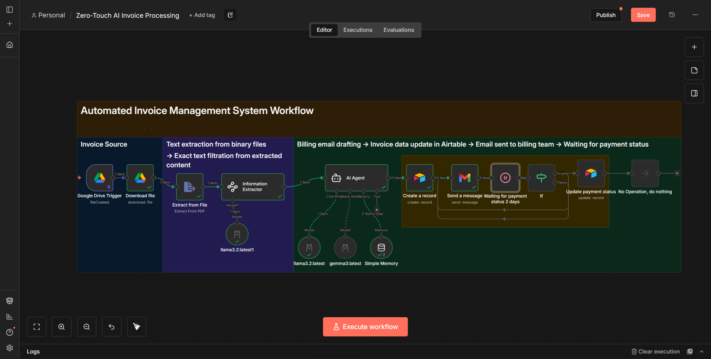

# 🚀 Zero-Touch AI Invoice Processing


---

## 📌 Project Overview

This project demonstrates a **Zero-Touch AI Invoice Processing system** built using **n8n**, designed to transform a **manual, error-prone billing workflow** into a **fully automated, event-driven pipeline**.

The automation handles invoice ingestion, text extraction, AI-based understanding, email communication, data storage, and payment follow-ups — all with minimal human intervention.

> **Status:** Demo Phase (Architecture is production-oriented)

---

### 🖼️ Automation Workflow:


### 🖼️ Generated results:


---

## 🔧 What This Automation Does

### 📥 Invoice Ingestion (Event-Driven)

* Monitors a dedicated **Google Drive invoices folder**
* Triggers only on **new or updated PDF invoices**
* Eliminates manual uploads and polling-based checks

### 📄 Document Processing & Text Extraction

* Downloads invoices as **binary files**
* Extracts clean, usable text from PDFs
* Filters layout noise while preserving financial accuracy

### 🧠 AI-Based Invoice Understanding

* AI Agent interprets extracted invoice text
* Identifies invoice number, dates, amounts, and company details
* Outputs **structured JSON data** for downstream use

### ✉️ Automated Billing Email Generation

* Auto-drafts professional billing emails
* Injects invoice-specific fields dynamically
* Ensures consistent tone without hardcoded templates

### 🗂️ Centralized Invoice Data Storage

* Stores structured invoice data in **Airtable**
* Acts as a single source of truth
* Enables tracking, auditability, and analytics

### ⏳ Payment Follow-Up Orchestration

* Introduces timed wait windows
* Sends reminders **only when payment is pending**
* Prevents duplicate or unnecessary follow-ups

### 🔁 State-Driven Status Management

* Automatically updates invoice status
* Ensures idempotent, restart-safe workflow execution
* Keeps the full invoice lifecycle traceable

---

## ❓ Why This Project

Manual invoice processing doesn’t scale.

This project focuses on:

* Reducing human errors
* Preventing missed payment follow-ups
* Creating a reliable audit trail
* Demonstrating how **AI Agents + workflow orchestration** solve real operational problems

It’s not a chatbot — it’s a **stateful, production-style automation**.

---

## 🧰 Tech Stack

* **n8n** – Workflow orchestration
* **AI Agents (LLMs)** – Invoice understanding & email drafting
* **Google Drive** – Invoice ingestion
* **Gmail** – Automated email communication
* **Airtable** – Invoice data storage & status tracking

---

## 📁 Folder Structure

```text
zero-touch-ai-invoice-processing/
├── workflows/
│   └── invoice-processing.json
├── images/
│   ├── workflow-overview.png
│   ├── invoice-processing.png
│   └── email-automation.png
├── prompts/
│   └── architecture.md
├── .env.example
├── README.md
```

---

## ⚙️ Setup Overview

1. Clone the repository
2. Import the workflow JSON into **n8n**
3. Configure credentials:

   * Google Drive
   * Gmail
   * Airtable
   * AI / LLM provider
4. Update environment variables using `.env.example`
5. Activate the workflow

> Designed to work with **local or cloud-based LLMs**.

---

## 🎯 Use Cases

* Freelancers & agencies handling recurring invoices
* Finance teams automating billing operations
* Startups reducing manual accounting overhead
* Learning reference for **AI + n8n production workflows**

---

## 🤝 Connect

If you’re working with **n8n**, **AI workflows**, **automation**, or **local LLMs**, feel free to connect.

🔗 This project is also featured in my **LinkedIn Projects** section.

---

**No hype — just building things that actually work.** 🚀
